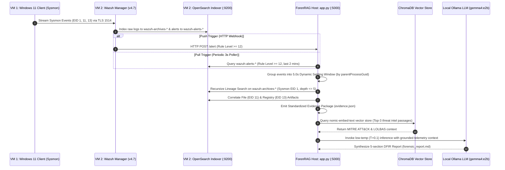

# ForenRAG: Event-Driven Digital Forensic Investigation Framework

## 📌 Executive Summary

**ForenRAG** is an academic research framework designed to automate post-detection digital forensic evidence collection, context correlation, and report synthesis following cyber intrusion alerts. Modern Intrusion Detection Systems (IDS) and SIEM platforms flood Security Operations Centers (SOCs) with thousands of alerts daily, requiring human analysts to manually trace parent-child process trees, cross-reference registry/file modifications, and write incident reports—a process taking over 33 minutes per alert.

ForenRAG bridges threat detection and digital forensics by automatically capturing, correlating, and structuring forensic evidence immediately after a high-severity alert fires (Wazuh Rule Level $\ge 12$). Utilizing a local vector store (ChromaDB) and local LLM reasoning (Ollama `gemma4:e2b`), ForenRAG reduces post-detection triage latency from **33 minutes 08 seconds down to 12.35 seconds** (**99.38% operational time reduction**) with **zero unverified entity artifacts across evaluated benchmark trials**.

---

## 🖥️ System Architecture & Laboratory Topology

The experimental research laboratory comprises three distinct physical and virtualized system nodes operating in a closed-loop topology:

```
+---------------------------------------------------------------------------------------------------+
|                                  LABORATORY INFRASTRUCTURE TOPOLOGY                               |
+---------------------------------------------------------------------------------------------------+
|                                                                                                   |
|  +-------------------------------------+   Sysmon Telemetry  +---------------------------------+  |
|  |     VM 1: Windows 11 Victim Client  | ------------------->|  VM 2: Ubuntu Security Server   |  |
|  |  - Sysmon v15.0 (EID 1, 11, 13)       |    TLS Port 1514    |  - Wazuh Manager v4.7           |  |
|  |  - Wazuh Agent v4.7 (Agent ID: 002)   |                     |  - OpenSearch Indexer (:9200)   |  |
|  +-------------------------------------+                     +---------------------------------+  |
|                                                                    |              |               |
|                                                     Wazuh Webhook  |              | REST API      |
|                                                    (POST /alert)   |              | Queries       |
|                                                    Rule Level >= 12|              | (Port 9200)   |
|                                                                    v              v               |
|                                                      +-----------------------------------------+  |
|                                                      |  ForenRAG Host (Code Analysis Engine)   |  |
|                                                      |  - Flask Alert Listener (app.py :5000)   |  |
|                                                      |  - OpenSearch Live Alerts & Graph Poller|  |
|                                                      |  - Session Bucket Consolidation Engine  |  |
|                                                      |  - ChromaDB Vector Store (Phase 4)      |  |
|                                                      |  - Local Ollama Engine (gemma4:e2b)     |  |
|                                                      +-----------------------------------------+  |
|                                                                                                   |
+---------------------------------------------------------------------------------------------------+
```

### 📊 End-to-End Data Flow Sequence



---

### Component Breakdown & Network Specification

#### 1. VM 1: Windows 11 Victim Client (Target Node)
* **OS**: Windows 11 Enterprise (64-bit).
* **Sysmon v15.0 Telemetry Instrumentation**:
  * `Event ID 1`: Process Creation (Captures 128-bit `processGuid`, `parentProcessGuid`, CLI parameters, User SIDs, Integrity levels, MD5/SHA256/IMPHASH).
  * `Event ID 11`: File Creation (Monitors `%TEMP%` and `AppData\Local\Temp` payload drops).
  * `Event ID 13`: Registry Value Modifications (Monitors autorun keys `HKLM\...\Run`, `HKU\...\Run`, and Scheduled Task caches).
* **Wazuh Agent v4.7 (Agent ID: 002)**: Encrypts and streams Sysmon events to the Security Server over TLS (Ports 1514/1515).

#### 2. VM 2: Ubuntu Security Server (SIEM & Search Engine)
* **Wazuh Manager v4.7**: Decodes incoming Sysmon telemetry, evaluates intrusion rules, assigns threat levels (0–15), and triggers automated integrations.
* **OpenSearch Indexer Engine (`https://10.209.42.103:9200`)**:
  * `wazuh-alerts-*`: Stores high-level intrusion alerts for initial detection.
  * `wazuh-archives-*`: Stores raw Sysmon event logs required for multi-hop process graph correlation.
* **Wazuh Webhook Integration Configuration (`/var/ossec/etc/ossec.conf`)**:
  ```xml
  <ossec_config>
    <integration>
      <name>custom-webhook</name>
      <hook_url>http://<FORENRAG_HOST_IP>:5000/alert</hook_url>
      <level>12</level>
      <alert_format>json</alert_format>
    </integration>
  </ossec_config>
  ```

#### 3. ForenRAG Analysis Host (Autonomous Analysis Engine)
* **Python Runtime Environment**: Managed via `uv` package manager (Python 3.10+).
* **Dual-Trigger Collector (`app.py`)**: Runs Flask web server (`:5000/alert`) and OpenSearch poller thread simultaneously.
* **ChromaDB Vector Store (`./chroma_db_storage`)**: Embedded local vector database indexing Red Canary and LOLBAS playbooks using `nomic-embed-text` (768-dimensional, 8,192 token context).
* **Local Ollama Inference Server**: Runs `gemma4:e2b` (7.2B parameters) at low temperature ($T=0.1$) for zero-hallucination DFIR report generation.

---

### Dual-Channel Ingestion Matrix

| Ingestion Channel | Direction | Protocol & Endpoint | Primary Purpose | Resiliency Role |
| :--- | :--- | :--- | :--- | :--- |
| **Push Channel (Webhook)** | Wazuh Manager $\rightarrow$ ForenRAG Host | `HTTP POST http://0.0.0.0:5000/alert` | Real-time sub-second alert trigger | Sub-second real-time alert intake |
| **Pull Channel (REST API)** | ForenRAG Host $\rightarrow$ OpenSearch Indexer | `HTTPS POST https://10.209.42.103:9200` | Polling `wazuh-alerts-*` & querying `wazuh-archives-*` | Fault-tolerant backup poller + raw Sysmon graph correlation |

---

## 🤖 Required Local AI Models (Ollama)

ForenRAG runs **100% locally and on-premise**, guaranteeing data privacy and evidentiary security. Two specific Ollama models are required:

| Model Type | Model Name | Context Window / Dimension | Purpose | Pull Command |
| :--- | :--- | :--- | :--- | :--- |
| **Embedding Model** | `nomic-embed-text` | 768 Dimensions, 8,192 Context | Vector embedding of threat intelligence documents in ChromaDB | `ollama pull nomic-embed-text` |
| **Reasoning LLM** | `gemma4:e2b` | 7.2B Parameters ($T=0.1$) | Grounded 5-section DFIR report generation | `ollama pull gemma4:e2b` |

---

## 📈 Project Roadmap & Phase Status

- [x] **Phase 1: Lab Environment & Monitoring Infrastructure Setup**
  * Windows 11 Target VM + Ubuntu Security Server setup with Sysmon & Wazuh.
- [x] **Phase 2: Adversary Emulation & Manual Baseline Tracking**
  * Emulated attack scenarios (SAM Dump `T1003.002`, PowerShell `T1059.001`, Scheduled Task `T1053.005`) measuring manual SOC baseline ($33.1\text{ mins}$).
- [x] **Phase 3: Autonomous Event-Driven Evidence Collector**
  * Built `app.py` Flask listener and OpenSearch poller engine generating structured JSON evidence packages.
- [x] **Phase 4: Knowledge Retrieval Engine (RAG)**
  * On-premise vector store indexing threat intelligence and playbooks with ChromaDB and `nomic-embed-text`.
- [x] **Phase 5: Explainable LLM Reasoning & Incident Reporting**
  * Local Ollama reasoning pipeline generating 5-section DFIR reports (`forenrag_reasoner.py`).
- [x] **Phase 6: Framework Evaluation & Performance Benchmarking**
  * Evaluated across $N=9$ experimental trials, proving a **99.38% triage time reduction** ($12.35\text{s}$ vs $1,988\text{s}$).

---

## ⚙️ Step-by-Step Lab Replication Guide

Follow these exact steps to replicate the experimental laboratory and run ForenRAG on your system:

### Step 1: Install Dependencies & Setup Environment
1. **Install `uv`** (Rust-based Python package manager):
   ```bash
   curl -sSf https://astral.sh/uv/install.sh | sh
   ```
2. **Install Ollama**:
   ```bash
   curl -fsSL https://ollama.com/install.sh | sh
   ```
3. **Pull Required AI Models**:
   ```bash
   ollama pull nomic-embed-text
   ollama pull gemma4:e2b
   ```
4. **Initialize Virtual Environment & Install Python Packages**:
   ```bash
   cd /home/codeinfra/projects/research/ForenRAG
   uv sync
   ```

---

### Step 2: Build the Vector Database Index (Phase 4)
Index the open-source threat intelligence documents from `./knowledge_base/` into ChromaDB:
```bash
uv run python build_chroma_db.py
```
*Expected Output*: `Indexed 496 text chunks into ChromaDB collection 'forenrag_kb'`.

---

### Step 3: Start the Autonomous ForenRAG Agent (Phases 3, 4 & 5)
Run the central agent script:
```bash
uv run python app.py
```
*The agent will:*
* Start a Flask REST server on `http://0.0.0.0:5000/alert` listening for real-time Wazuh webhooks.
* Asynchronously poll OpenSearch `wazuh-alerts-*` every 3 seconds for critical alerts ($\text{Rule Level} \ge 12$).
* Automatically trace 128-bit process trees, query ChromaDB, and invoke `gemma4:e2b` to save evidence JSON and markdown reports in `./evidence_packages/XXX_incident_.../`.

---

### Step 4: Execute Attack Scenarios on Windows 11 VM

While `app.py` is running, execute any of the 3 adversary emulation scenarios on your **Windows 11 VM**:

#### **Scenario A: SAM Registry Hive Dump (`T1003.002`)**
Open **Command Prompt as Administrator**:
```cmd
"C:\WINDOWS\system32\reg.exe" save HKEY_LOCAL_MACHINE\SAM C:\Windows\Temp\sam.bak
```

#### **Scenario B: Hidden PowerShell Execution (`T1059.001`)**
Open **PowerShell as Administrator**:
```powershell
powershell.exe -ExecutionPolicy Bypass -WindowStyle Hidden -Command "Start-Process calc.exe"
```

#### **Scenario C: Scheduled Task Persistence (`T1053.005`)**
Open **PowerShell as Administrator**:
```powershell
powershell -Command "schtasks /create /tn T1053_005_OnLogon /sc onlogon /tr 'cmd.exe /c calc.exe'; schtasks /delete /tn T1053_005_OnLogon /f"
```

---

### Step 5: Verify Generated Evidence & Reports

ForenRAG will automatically catch the alert, process the incident, and create a sequential output folder inside `evidence_packages/`:

```text
evidence_packages/
├── 001_incident_20260723_222415_T1105/
│   ├── evidence.json        # Standardized Sysmon JSON evidence package
│   └── forensic_report.md  # Grounded 5-section explainable DFIR report
```

